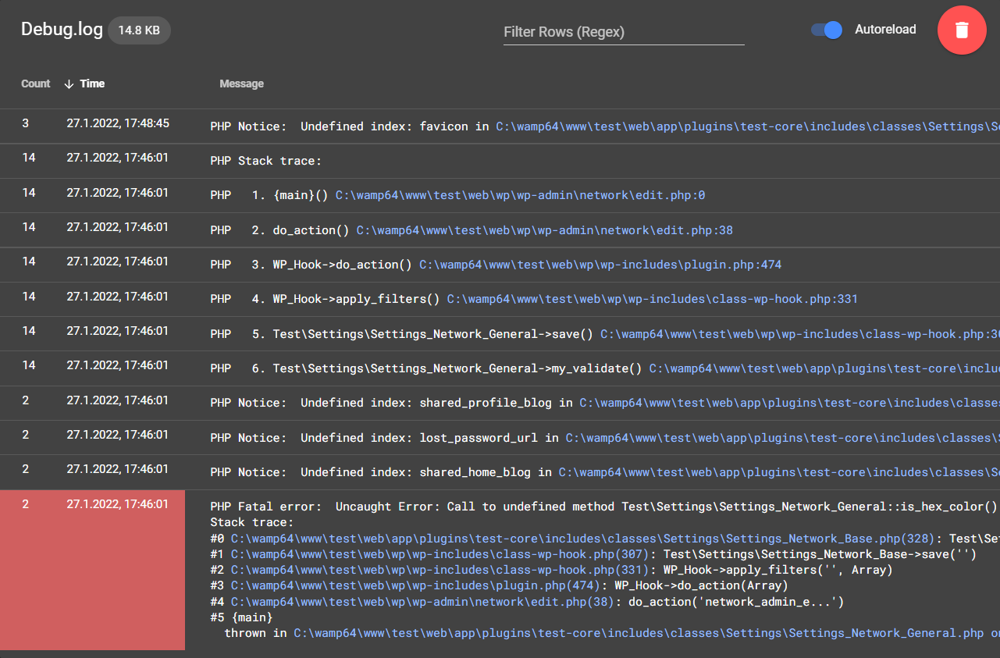

# PHP Error Log Viewer


A GUI for your php log files which groups similar errors. Written in PHP and Vue.js.

 - Reads the specified log file and automatically shows you new errors when they appear.
 - Groups errors with similar text. This is far from perfect and just works with the (default) log-format like:  
   ```[12-Jun-2030 12:58:55] PHP Notice: ...```
 - Can be configured so clicking on an error will directly bring you to the mentioned file and line in vscode ([more below](#linking)).
 - Requires > PHP 7.4

## Disclaimer
 - This contains code for deleting your log-file.
 - Might be heavy for you server for large log files (regexp-parsing).
 - It is meant for development-environments.
 - Created for log-files in the format ``[31-Mar-2021 14:25:56 UTC] PHP Notice: ...`` (nginx logs are currently not supported).
 - There is still room for improvement (especially where the log-file is parsed).
 - It does not work offline, as we rely on [cdns](https://en.wikipedia.org/wiki/Content_delivery_network) to load dependencies like vue. 

## Getting Started

Just copy the folder next to your debug.log.

or
```bash
composer require-dev schuhwerk/php-error-log-viewer
```

## Usage

Open the folder in your browser (like http://mydomain.local/php-error-log-viewer)



## Settings

You can specify settings in a file named 'php-error-log-viewer.ini' in the same folder (or for composer in the grandparent folder).

```ini
;path the the log file. relative to the viewer file.
file_path='../../app/debug.log'
;toggle the linking feature
vscode_links=true
;when you run a virtual machine for development your server path might diverge from your loacal path. this is server.
vscode_path_search='/srv/www/current/'
;
vscode_path_replace='C:/my-repository/'
```

## Linking
The log viewer extracts paths and line numbers from your log file (transforms them) and creates [vscode links](https://code.visualstudio.com/docs/editor/command-line#_opening-vs-code-with-urls).
This works for the following samples:

- <mark>/srv/www/web/app/themes/defaultspace/functions.php(605)</mark>: get_post_card(Object(WP_Post), Array)
- PHP Fatal error:  Uncaught TypeError: ..., called in <mark>C:\foo\bar/themes/defaultspace/functions.php on line 605</mark> 
- ... and defined in <mark>C:\foo\bar/themes/defaultspace/functions.php:63</mark>
- ✨Tip: Use this (php) [snippet in vscode](https://code.visualstudio.com/docs/editor/userdefinedsnippets) (and enjoy the links):
  ```json
  "Log to error log": {
		"prefix": "error_log",
		"body": [
			"error_log( \"$1\" . __FILE__ . ' on line ' . __LINE__ . \"\\n\" . print_r( $2, true ) );",
			"$4"
		],
		"description": "Log array/object to error log."
	}
  ```

## Ideas
- This was a single-file gui. As it went bigger we separated files (to improve readability). There could be a build-step which brings things back to a single file (like [adminer](https://github.com/vrana/adminer) uses).
- Update to vue3
- Use vuetify instead vue-material.
- Make offline useable.
- Find a way to keep stack-traces together (while sorting)


